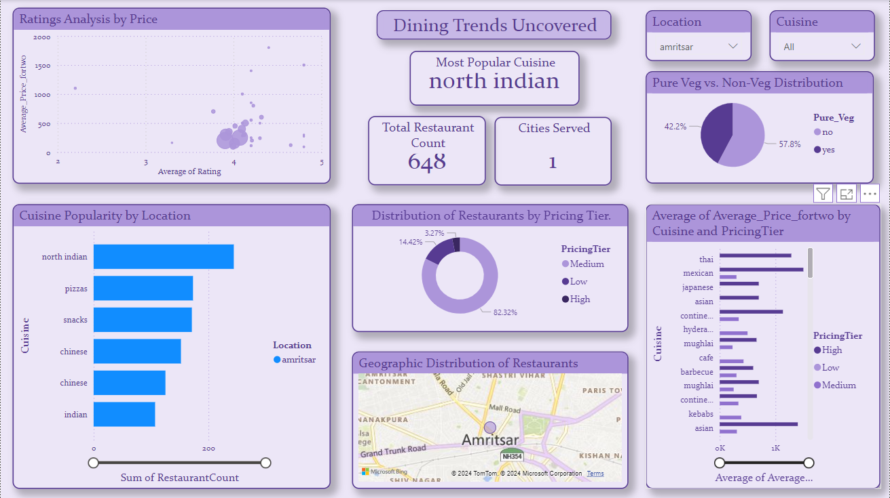

### **Restaurant Data Analysis Project**

---

#### **Overview**
This project focuses on analyzing restaurant data from the Abohar region to derive meaningful insights regarding pricing, customer preferences, cuisine popularity, and offer trends. The dataset provides detailed information about restaurants, including ratings, cuisines, pricing, and promotional offers.

---

#### **Features**
- **Cuisines Analysis:** Understand popular cuisines and their distribution across different areas.
- **Customer Ratings:** Insights into highly-rated and popular restaurants based on customer feedback.
- **Offers and Discounts:** Analyze active offers and their effectiveness in attracting customers.
- **Geographic Trends:** Explore how restaurant locations influence ratings and popularity.
- **Vegetarian Preferences:** Identify trends in pure vegetarian vs. mixed-menu restaurants.

---

#### **Dataset Details**

| **Column Name**       | **Description**                                                                                   |
|------------------------|---------------------------------------------------------------------------------------------------|
| **Restaurant Name**    | Name of the restaurant.                                                                          |
| **Cuisine**            | Types of cuisines offered by the restaurant (e.g., Pizzas, Indian, Fast Food).                   |
| **Rating**             | Average customer rating of the restaurant (e.g., 4.2, NEW for unrated).                          |
| **Number of Ratings**  | The approximate number of customer ratings received by the restaurant.                            |
| **Average Price**      | Average price for two people at the restaurant.                                                  |
| **Number of Offers**   | Total number of active offers available for the restaurant.                                       |
| **Offer Name**         | Details of active offers and applicable conditions.                                               |
| **Area**               | Specific area where the restaurant is located.                                                   |
| **Pure Veg**           | Indicates whether the restaurant is vegetarian only (`Yes`) or serves non-vegetarian food (`No`). |
| **Location**           | Broader location (e.g., city or town name).                                                      |

---

#### **Technologies Used**
- **Data Cleaning and Processing:** MYSQL  
- **Data Visualization:** Power BI, Matplotlib, Seaborn  
- **Database Management:** MySQL 
- **Deployment:** Suitable for integration into dashboards (Power BI, Tableau)  

---

#### **Key Insights**
- Popular cuisines and their price ranges.  
- Restaurants with the highest customer satisfaction based on ratings.  
- Offers and discounts that attract the most customers.  
- Geographic distribution of restaurants across areas in Abohar.  
- Trends in vegetarian vs. non-vegetarian preferences.

---

#### **Known Issues**
- **Missing Data:** Some restaurants have `NEW` in the ratings column, indicating no customer ratings yet.  
- **Text Formatting:** Columns such as `Average Price` and `Number of Ratings` include text and symbols that need cleaning for analysis.  
- **Offers Column:** Requires parsing for structured analysis of promotional offers.

---

